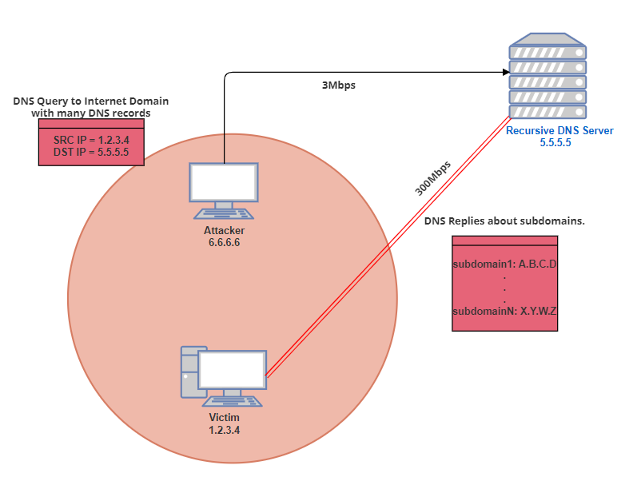

# DNSAmplification
#### Network Diagram
 <div align="center">
	
</div>

This Proof-of-Concept[PoC] tool exploit DNS resolvers to perform an huge amplification attack against a specific Victim (specifying its IP).
It hides the basic idea behind the attack.

DNS Amplifications Attacks are performed by an attacker to increase the bandiwidth amount in order to sends a targeted potential victim.
The traditional amplification attack is known as a SMURF attack:
	SMURF Attack:
		An attacker spoofs a neighbour's IP address (of the potential victim).
		He sends an ICMP request to the network's broadcast address (X.X.X.255).
		This is configured to relay ICMP to all devices that stays behind the router.
		ICMP doesn't include a handshake, the destination devvice has no way to check if 		the source IP is legitimate.
		
1)The router will passes it on all the devices that sit behind it.
2)All those devices then respond back to the ping.
		
### DNSAmplification in particular:
		UDP doesn't require a handshake == source attribute can be spoofed.
		The idea is to have the response to the query significantly biffer than the original query itself.
	
		We need a DNS Open-resolver configured to resolve recursive queries, no an Authorative Server.
		
There are Linux built-ins command that helps to discover if a particular DNS server is an open resolver:

dig TARGET@x.x.x.x where's x.x.x.x is the DNS ip.

A DNS Open-resolved configured as we desire will return a response similar to this example:
```
; <<>> [Ubuntu-Host] <<>> TARGET @ x.x.x.x
;; global options: +cmd
;; Got answer:
;; ->>HEADER<<- opcode: QUERY, status: NOERROR, id: 53931
;; flags: qr rd ra; QUERY: 1, ANSWER: 1, AUTHORITY: 0, ADDITIONAL: 0
```
STATUS = NOERROR
Instead, an Authorative DNS will return a response like this:

```
; <<>> [Ubuntu-Host] <<>> TARGET @x.x.x.x
;; global options: +cmd
;; Got answer:
;; ->>HEADER<<- opcode: QUERY, status: REFUSED, id: 47106
;; flags: qr rd; QUERY: 1, ANSWER: 0, AUTHORITY: 0, ADDITIONAL: 0
;; WARNING: recursion requested but not available
```
STATUS=REFUSED


This PoC uses Shodan APIs in order to identifies open resolvers across the internet, saves IP address into a json that will be convert in a txt file and
using Scapy in order to make a DNS query with neighbour's IP spoofed and redirect the replies-storm to him.

PRE-REQUISITES:
<ul>
<li>Scapy - libary for packet manipulation.</li>
<li>Shodan library installed.</li>
	
	pip install shodan or easy_install shodan
<li>Shodan API-Key for Developer. <a href=https://account.shodan.io/>Sign up in Shodan</a></li>		
		
			
<li>Scapy - libary for packet manipulation.</li>
	
		pip install --pre scapy
</ul>
	
	
